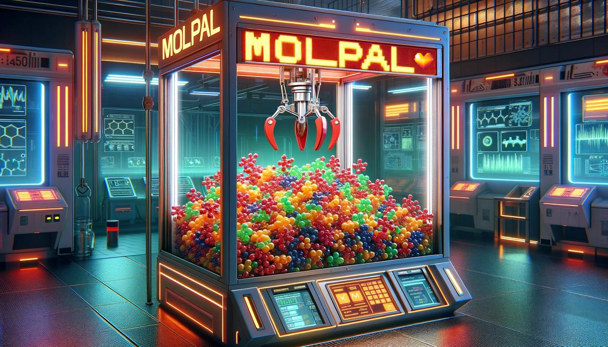

<h1 align="center">
Leveraging Active Learning with uncertainty quantification by Investigation of Molpal Exploration
</h1>

**Note :This repository is a fork from https://github.com/coleygroup/molpal**

**Any file added or modified within the last 2 years must be considered as part of our ‘molpal version’.**

## 🔍 Overview 🔎

Molpal (Molecular Pool-based Active Learning) is a software created by the coleygroup for the accelerated discovery of compounds in high-throughput virtual screening environments.
Using  a modified version of Molpal, the objective of this project is to find a good way to leverage active learning and uncertainty quantification to minimize the number of total molecules acquired by the algorithm, while recovering a good percentage of the top X%  of the candidates depending on the dataset.

## 🔨 Installation 🔨

1. Clone the modified version of Molpal from this repository:

```
git clone https://github.com/Nohalyan/molpal
```

2. Install the necessary dependencies. You can use the environment.yml for Conda or use the 'requirements.txt' using pip after the  installation of the repository.

```
pip install -r requirements.txt
```

3.   Install the repository:
 
```
pip install -e 
```
4. Import all the functions using the following command

```
from molpal.acquirer import Acquirer
from molpal.featurizer import Featurizer
from molpal.models import Model
from molpal.objectives import Objective
from molpal.pools import pool
from molpal.exceptions import IncompatibilityError, InvalidExplorationError
from molpal.explorer import Explorer
```

## 📝 Notebooks 📝
In the notebooks file, we provide the notebook we used to carry out our various experiments in order to observe the effects of:

- UCB & Score correlation
- Initialization size
- UCB & β study
- Acquisition function on active learning
- Diversity
- UCB & Score correlation on an Artficial 10k dataset
- UMAP

## 📗 License 📕 
This project and Molpal software used are licensed under the MIT License.

## 📜 References 📜

**This repository is a fork from https://github.com/coleygroup/molpal**

This project is based on Molpal software, developed by the Coley Group: https://github.com/coleygroup/molpal

## 📖 Authors 📖
- Gaedecke Kelian: https://github.com/KelianGaedecke
- Segura David: https://github.com/Davidmingsegura
- Cossard Lucas: https://github.com/Nohalyan

This project was carried out as part of EPFL's AI for Chemistry course.
